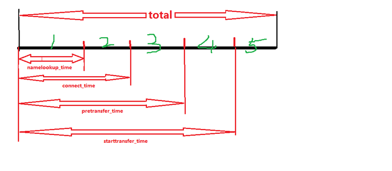

@raspberrypi:~ $ df -h
文件系统        容量  已用  可用 已用% 挂载点
/dev/root       7.2G  3.6G  3.3G   52% /
devtmpfs        459M     0  459M    0% /dev
tmpfs           463M     0  463M    0% /dev/shm
tmpfs           463M  6.4M  457M    2% /run
tmpfs           5.0M  4.0K  5.0M    1% /run/lock
tmpfs           463M     0  463M    0% /sys/fs/cgroup
/dev/mmcblk0p1   60M   20M   41M   34% /boot
tmpfs            93M     0   93M    0% /run/user/1000

15G的sd卡只能识别出7.2G 

 查看当前磁盘大小，总大小只有2.9GB
 查看第二分区的起始地址，后面会用到
 使用fdisk操作磁盘
 d，删除分区
 2，删除第二分区
 创建一个新分区
 创建主分区
 分区2
 输入第一次得到的第二分区起始扇区
 最后一个sector，默认即可
 将上面的操作写入分区表
设置完成需要重启，sudo reboot
 
重启完成，使用df -h查看发现空间并没有增大，还需要输入
resize2fs /dev/mmcblk0p2
等待一会儿操作完成，再次使用df -h查看发现空间已变大成15GB
 
重启完成，使用df -h查看发现空间并没有增大，还需要输入
resize2fs /dev/mmcblk0p2
等待一会儿操作完成，再次使用df -h查看发现空间已变大成15GB
