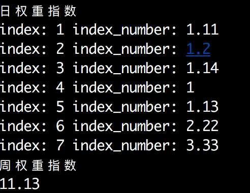

#寻找零售密码#

##1，寻找店铺零售规律##

零售业的规律就是以周为单位不断循环的过程。不论是传统零售还是电子商务都会遵从这一规律，区别是传统零售一般周末是销售高峰，电子商务反而一般。

要找出零售业销售数据的规律性，需要做一些技术处理。 首先剔除每个月中那些异常数据再做分析会比较靠谱。

* 法定节假日
* 法定节假日的调休日：属性发生了改变
* 行业特殊日：情人节，三八节，圣诞节等，是否需要剔除需要看业态或行业的特性。
* 非正常销售日：店庆等

##2，周权重指数##

周权重指数是以某段销售周期内的历史日销售额为基础，以周为单位，进行权重分析处理的一种工具。周权重指数是一个相对概念，每个企业都不尽相同，一般介于7.0 ~ 14.0。**值越大表示企业或者店铺的日销售额波动幅度越大。 周权重指数是零售店铺用来量化处理各种销量状况，销售事件的管理工具。**

周权重指数等于周一到周日每天的日权重指数相加。

是否每个店铺都需要自已的周权重指数？

* 显的比较乱套
* 不利于后期的标准化应用

计算集团标准时，首先利用汇总数据计算出集团的周权重指数，这个周权重指数就是企业标准，其他分店只需要用这个标准去推导自已的日权重指数就行了。所以每个企业只会有一个周权重指数，但是星期一至星期日的日权重指数每个分店可能是不一致的。

确定完企业标准的周权重指数后，就不要轻易更改了，接下来开始计算各分店或分部的日权重指数，也就是找到总部以下单位的销售规律。

* 计算分部规律不需要全年的数据，有三个月的销售数据就行，一般是最近两个月和去年同期月份数据。例如在预测2013-10月的全部销售规律时，可以收集2013-08, 2013-09，以及2012-10月的数据，这样的好处是考虑了数据的时效性，又考虑了数据同期的可参照性。
* 去除异常数据
* 将剩下的数据以周为单位整理，然后计算出周中每天平均日销售额以及平均周销售额。
* 分部 日权重指数公式 星期N的权重指数 =（星期N的平均日销售额 / 平均周销售额）* 企业周权重指数

从这处步骤来看，分部的销售规律需要每个月都处理一次，即通过三个月的历史数据来预测下个月的销售规律。

##周权重指数的应用##

权重指数的目的是为了给365天都赋予权重值。正常状态下赋予每天常规的权重，促销时使用促销级别考虑进去的特殊权重，节假日则使用节假日权重。

