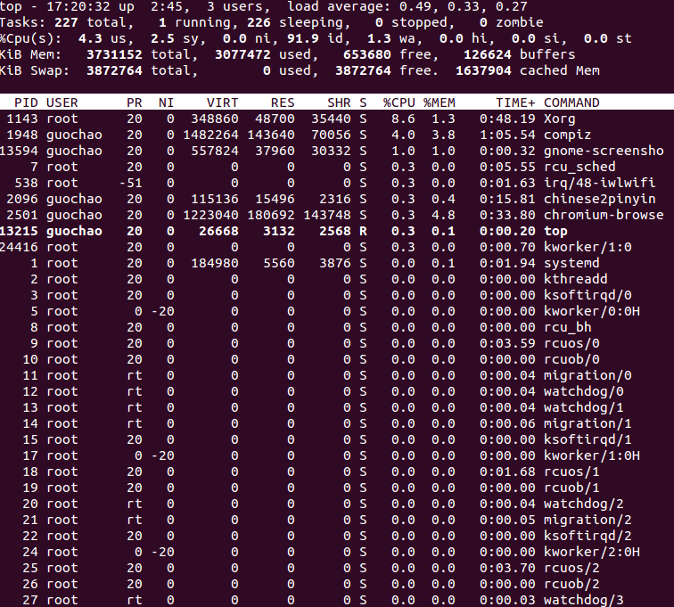

top 命令提供系统信息的摘要和按任务的CPU密集度排序的系统进程的动态视图。

PID: 进程ID
USER: 进程使用者
PR: 进程的实际优先级，是给内核看的
NI: 优先级，是用户层面的概念
VIRT: 虚拟内存，进程需要的虚拟内存大小，包括进程使用的库，代码，数据等。
RES: 常驻内存，进程当前使用的内存大小，但不包括swap out
SHR: 共享内存
S — 进程状态。D=不可中断的睡眠状态 R=运行 S=睡眠 T=跟踪/停止 Z=僵尸进程

第一行显示当前时间，表示机器运行的天数，当前用户在线数，系统1分钟，5分钟，15分钟的CPU负载信息。
第二行任务，表示当前一共n个进程。

%us 用户态进程占用CPU的时间百分比，不包括renice值为负的任务所占用的CPU时间
%sy 内核占用的CPU时间百分比
%ni renice时间为负的任务的用户态进程的CPU时间百分比
%id 空闲CPU时间百分比
%wa 等待I/O的CPU时间百分比
%hi CPU硬中断时间百分比
%si CPU软中断时间百分比
%st 分配给运行在其它虚拟机上的任务的实际CPU时间，st值较高的话，需要向主机供应商申请扩容虚拟机。

第四行表示内存状态

KiB Mem:   3731152 total,  3356792 used,   374360 free,   128780 buffers

total : 物理内存总量
used : 使用中的内存总量
free : 空闲内存总量
buffers : 缓存的内存量

使用中的内存总量指的是现在系统内核控制的内存数，空闲内存总量指的是内核还未纳入其管控范围的数量。纳入内核管理的内存不见得都在使用中，还包括过去使用过的现在还可以重复使用的内存，内核并不把这些可被重新使用的内存交还到free中，因此在linux上的free内存会越来越少。但不用为这个担心

KiB Swap:  3872764 total,        0 used,  3872764 free.  1696808 cached Mem

第五行表示，swap交换分区信息
total　交换分区总量
used : 使用的交换区总量
free: 空闲交换区总量
cached : 缓冲区的交换区总量

出于习惯去计算可用内存数, free + buffers + cached

对于内存监控，在top里需要时刻监控第五行swap交换分区的used，如果这个值在不停的变化，证明内存在不断进行内存和swap的数据交换，这说明真正的内存不够用了。

<space> 立即刷新

P 按CPU使用率排行

E 按mem排行

