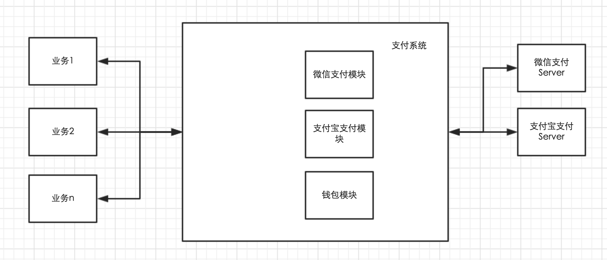
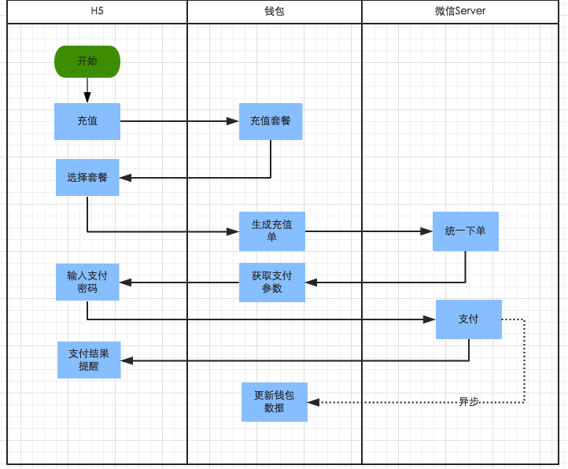
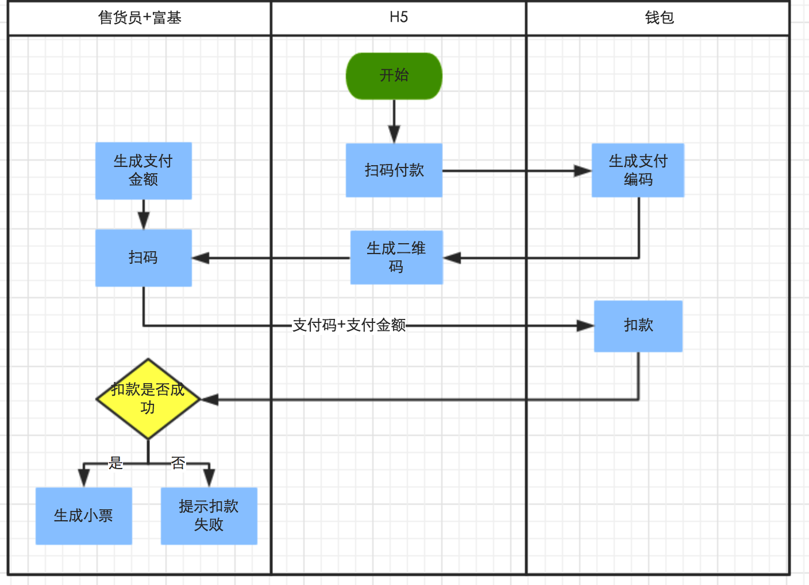
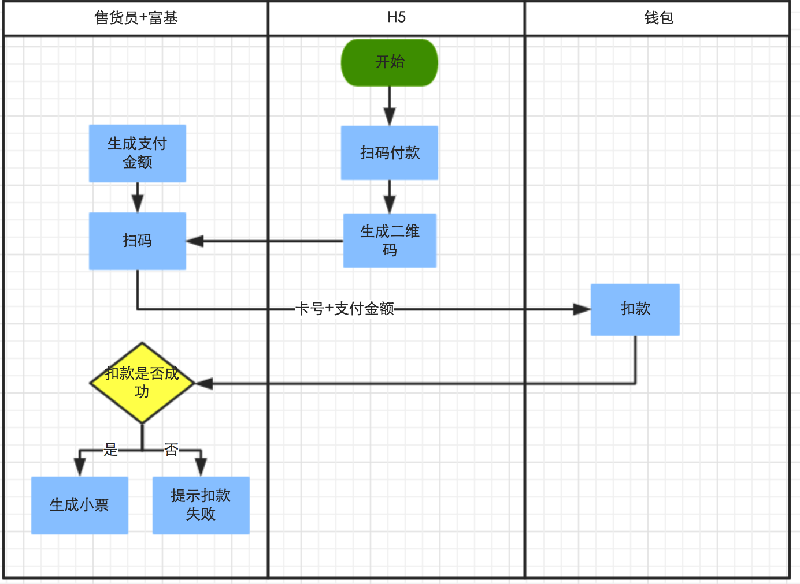

#钱包#

##1，系统边界##
从用户视角来看，钱包是一个在线的现金存储池，用于在线下商城和线下门店的消费场景。
从系统的视角来看，钱包除了在线的现金存储功能，还封装了常用的支付功能，包括微信，支付宝等。为线下ERP系统（富基）提供消费接囗，为财务系统提供对账单。
钱包的表现形式在具体业务的表现可能会不一样，比如在宠物店业务下，是以储值卡的形式存在。

##2，依赖与被依赖关系

###1，依赖
* 微信，支付宝等第三方支付平台

###2，被依赖
* 线上业务系统（预约，商城）
* 线下ERP系统（富基）
* 财务软件

##3，产品规划
钱包作为一个独立的服务，服务于各个使用到类似功能的业务。现阶段有宠物门店，宠物医院会接入钱包服务。定位于CRM系统中用户模块下的一个子服务。


##4，模块层次关系##



##5，在线充值流程图


##6，线下支付流程图
（1）安全模式

（2）快捷模式



##7，数据层设计

（1）用户储值卡表

```
CREATE TABLE `t_wallet_user_card` (
  `id` int(11) unsigned NOT NULL AUTO_INCREMENT,
  `card_id` varchar(32) DEFAULT NULL COMMENT '卡唯一编码',
  `merchant_code` varchar(32) DEFAULT NULL COMMENT '商户编号',
  `card_code` varchar(32) DEFAULT NULL COMMENT '卡编号',
  `account` varchar(32) DEFAULT NULL COMMENT '业务用户账号',
  `balance` int(11) DEFAULT NULL COMMENT '卡余额',
  `seqid` int(11) DEFAULT NULL COMMENT '操作序列号',
  `valid_time` datetime DEFAULT NULL COMMENT '过期时间',
  `add_time` datetime DEFAULT CURRENT_TIMESTAMP COMMENT '创建时间',
  `last_modify` timestamp NULL DEFAULT CURRENT_TIMESTAMP ON UPDATE CURRENT_TIMESTAMP COMMENT '最后一次修改时间',
  `status` int(11) DEFAULT '1' COMMENT '1正常 2删除',
  PRIMARY KEY (`id`),
  UNIQUE KEY `card_id` (`card_id`,`merchant_code`)
) ENGINE=InnoDB DEFAULT CHARSET=utf8mb4 COMMENT='用户储值卡'
```

（2）用户表

```
CREATE TABLE `t_wallet_user` (
  `id` int(11) unsigned NOT NULL AUTO_INCREMENT,
  `merchant_code` varchar(50) DEFAULT NULL COMMENT '商户号',
  `account` varchar(32) DEFAULT NULL COMMENT '业务用户编码',
  `salt` varchar(32) DEFAULT NULL COMMENT '干扰字段',
  `pass` varchar(32) DEFAULT NULL COMMENT '支付密码',
  `add_time` datetime DEFAULT CURRENT_TIMESTAMP COMMENT '创建时间',
  `last_modify` datetime DEFAULT CURRENT_TIMESTAMP ON UPDATE CURRENT_TIMESTAMP COMMENT '最后更新时间',
  `status` int(11) DEFAULT NULL COMMENT '10 正常 20 冻结 30删除',
  PRIMARY KEY (`id`)
) ENGINE=InnoDB DEFAULT CHARSET=utf8mb4 COMMENT='用户表';
```

（3）充值单表

```
CREATE TABLE `t_wallet_recharge_invoice` (
  `id` int(11) unsigned NOT NULL AUTO_INCREMENT,
  `recharge_id` bigint(20) DEFAULT NULL COMMENT '充值单号',
  `merchant_code` varchar(32) DEFAULT NULL COMMENT '商户号',
  `card_code` varchar(32) DEFAULT NULL COMMENT '卡编号',
  `account` varchar(32) DEFAULT NULL COMMENT '业务用户账号',
  `amount` int(11) DEFAULT NULL COMMENT '支付金额',
  `present` int(11) DEFAULT NULL COMMENT '赠送金额',
  `recharge_channel` int(11) DEFAULT NULL COMMENT '充值方式（微信jsapi支付）',
  `recharge_type` int(11) DEFAULT NULL COMMENT '充值类型(10买卡  20 充值  30赠送 40使用)',
  `add_time` datetime DEFAULT CURRENT_TIMESTAMP COMMENT '创建时间',
  `pay_time` datetime DEFAULT NULL COMMENT '支付时间',
  `status` int(11) DEFAULT NULL COMMENT '10 新建 20 支付成功 50关闭',
  PRIMARY KEY (`id`)
) ENGINE=InnoDB DEFAULT CHARSET=utf8mb4 COMMENT='充值单'
```

（4）支付方式字典表

```
CREATE TABLE `t_wallet_pay_dict` (
  `id` int(11) unsigned NOT NULL AUTO_INCREMENT,
  `name` varchar(20) DEFAULT NULL COMMENT '支付名称',
  `code` varchar(32) DEFAULT NULL COMMENT '支付方式编码',
  `trade_type` varchar(32) DEFAULT NULL COMMENT '交易类型',
  `status` int(11) DEFAULT '1' COMMENT '状态 1正常 2失效',
  PRIMARY KEY (`id`)
) ENGINE=InnoDB AUTO_INCREMENT=3 DEFAULT CHARSET=utf8mb4 COMMENT='支付方式字典表';
```

（5）应用支付信息表

```
CREATE TABLE `t_wallet_merchant_pay_channel` (
  `id` int(11) unsigned NOT NULL AUTO_INCREMENT,
  `merchant_code` varchar(32) DEFAULT NULL COMMENT '商户编码',
  `pay_channel_code` varchar(32) DEFAULT NULL COMMENT '支付方式编码',
  `pay_mch_id` varchar(50) DEFAULT NULL COMMENT '支付号',
  `pay_mch_code` varchar(50) DEFAULT NULL COMMENT '支付密钥',
  `app_id` varchar(50) DEFAULT NULL COMMENT '应用号',
  `app_secret` varchar(50) DEFAULT NULL COMMENT '应用密钥',
  `status` int(11) DEFAULT '1' COMMENT '状态 1正常 2失效',
  `add_time` datetime DEFAULT CURRENT_TIMESTAMP,
  PRIMARY KEY (`id`)
) ENGINE=InnoDB AUTO_INCREMENT=3 DEFAULT CHARSET=utf8mb4 COMMENT='应用支付信息';
```

（6）应用基本信息表

```
CREATE TABLE `t_wallet_merchant_info` (
  `id` int(11) unsigned NOT NULL AUTO_INCREMENT,
  `name` char(5) DEFAULT NULL COMMENT '商户名称',
  `code` varchar(32) DEFAULT NULL COMMENT '商户编码',
  `status` int(11) DEFAULT '1' COMMENT '状态 1有效 2无效',
  `add_time` datetime DEFAULT CURRENT_TIMESTAMP COMMENT '创建时间',
  PRIMARY KEY (`id`)
) ENGINE=InnoDB AUTO_INCREMENT=3 DEFAULT CHARSET=utf8mb4 COMMENT='应用基本信息';
```

（7）储值卡类型表

```
CREATE TABLE `t_wallet_card_type` (
  `id` int(11) unsigned NOT NULL AUTO_INCREMENT,
  `type_id` int(11) DEFAULT NULL COMMENT '卡类型编号',
  `type_name` varchar(50) DEFAULT NULL COMMENT '卡类型名称',
  `status` int(11) DEFAULT '1' COMMENT '卡类型状态1 正常 2失效',
  `add_time` datetime DEFAULT CURRENT_TIMESTAMP,
  PRIMARY KEY (`id`)
) ENGINE=InnoDB AUTO_INCREMENT=3 DEFAULT CHARSET=utf8mb4 COMMENT='储值卡类型';
```

（8）储值卡信息表

```
CREATE TABLE `t_wallet_card` (
  `id` int(11) unsigned NOT NULL AUTO_INCREMENT,
  `merchant_code` varchar(32) DEFAULT NULL COMMENT '商户编码',
  `card_code` varchar(32) DEFAULT NULL COMMENT '卡编号',
  `type_id` int(11) DEFAULT NULL COMMENT '卡类型',
  `init_amount` int(11) DEFAULT '0' COMMENT '初始充值金额',
  `present_amount` int(11) DEFAULT '0' COMMENT '赠送金额',
  `add_time` datetime DEFAULT CURRENT_TIMESTAMP COMMENT '创建时间',
  `status` int(11) DEFAULT '20' COMMENT '10上架 20下架 30删除',
  PRIMARY KEY (`id`),
  UNIQUE KEY `merchant_code` (`merchant_code`,`card_code`)
) ENGINE=InnoDB AUTO_INCREMENT=6 DEFAULT CHARSET=utf8mb4 COMMENT='储值卡信息';
```

(9) 流水表

```
CREATE TABLE `t_wallet_bill` (
  `id` int(11) unsigned NOT NULL AUTO_INCREMENT,
  `bill_id` varchar(50) DEFAULT NULL COMMENT '流水号',
  `bill_user` varchar(50) DEFAULT NULL COMMENT '操作用户',
  `amt` int(11) DEFAULT NULL COMMENT '操作的金额 区分正负',
  `bill_time` datetime DEFAULT CURRENT_TIMESTAMP COMMENT '操作时间',
  `bill_type` int(11) DEFAULT NULL COMMENT '流水类型 1加钱 2减钱',
  `bill_channel` int(11) DEFAULT NULL COMMENT '流水来源 10充值 20支付 30会滚',
  `merchant_code` varchar(32) DEFAULT NULL COMMENT '商户号',
  `bill_ret` int(11) DEFAULT NULL COMMENT '流水返回码 10未处理 20 成功 30失败',
  PRIMARY KEY (`id`)
) ENGINE=InnoDB DEFAULT CHARSET=utf8mb4 COMMENT='流水表';
```


##8，功能点
*  查询用户有效的储值卡
*  用户充值储值卡
*  查询用户储值卡流水
*  生成支付码（二维码）
*  消费储值卡
*  支付密码设置
*  修改支付密码
*  忘记支付密码